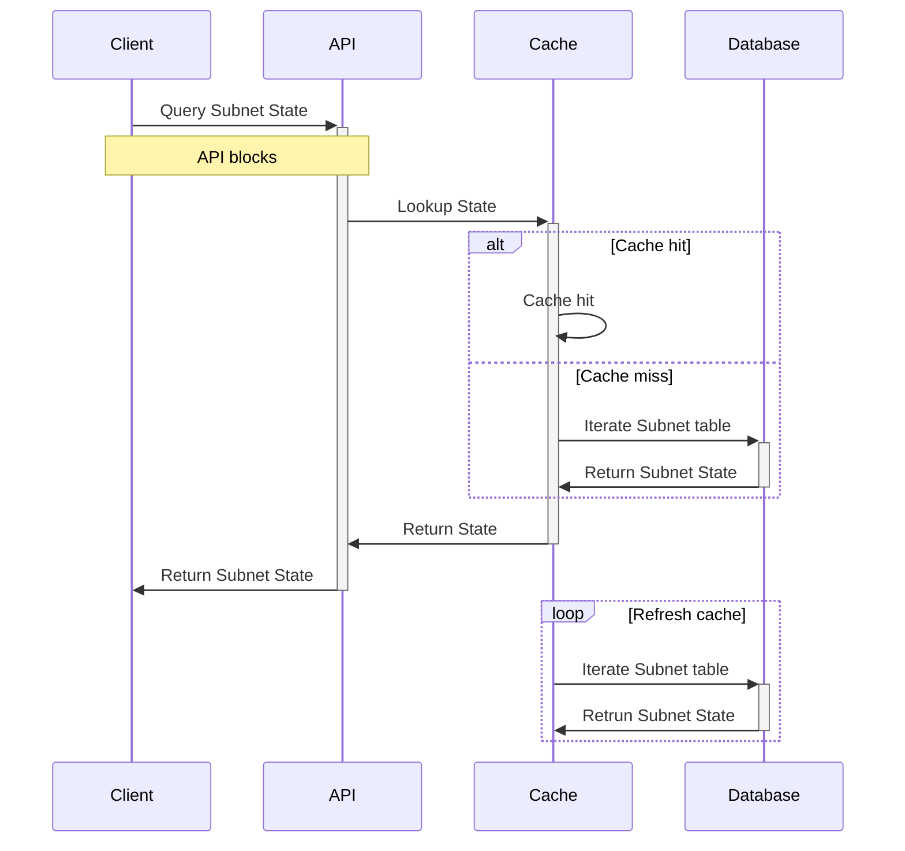

## DNC SubnetState API and Subnet Utilization cache [[Phase 1 Design](../proposal.md#1-1-subnet-utilization-is-cached-by-dnc)]

### SubnetState API
An API will be added to DNC which will provide the Reserved IP Count (the "Utilization") of a Subnet. The API will synchronously query the Subnet Utilization Cache and return the response from the Cache directly.

```yaml
paths:
  /networks/{networkID}/subnets/{subnet}/utilization:
    get:
      summary: Returns the Subnet State
      operationId: querySubnetState
      description: |
        Queries the State for the passed Subnet.                             
      parameters:
        - in: path
          name: networkID
          description: The Network ID
          required: true
          schema:
            type: string
        - in: path
          name: subnet
          description: The Subnet Name
          required: true
          schema:
            type: string
      responses:
        '200':
          description: The matching SubnetState
          content:
            application/json:
              schema:
                type: array
                items:
                  $ref: '#/components/schemas/SubnetState'
        '400':
          description: bad input parameter
components:
  schemas:
    SubnetState:
      type: object
      required:
        - timestamp
        - capacity
        - reserved
      properties:
        timestamp:
          type: string
          format: date-time
          example: '2016-08-29T09:12:33.001Z'
        capacity:
          type: integer
          example: 256
        reserved:
          type: integer
          example: 128
      description: The Subnet Utilization State
```

###  Subnet Utilization Cache
A cache will be added to DNC which will hold the the Subnet Reserved IP Count per Subnet. The cache will be implemented as a pull-through, self-refreshing cache with a configurable refresh rate. 

The cache will act as a proxy to the Database and, when queried for a Subnet which it does not already know about, will iterate the Subnet Table to build the present Subnet Utilization ("Loading"), cache that result, and return the result. The Subnet will be added to the Cache's Known Subnets, and the Cache will periodically iterate the Known Subnets and re-Load their Utilization from the Database.



