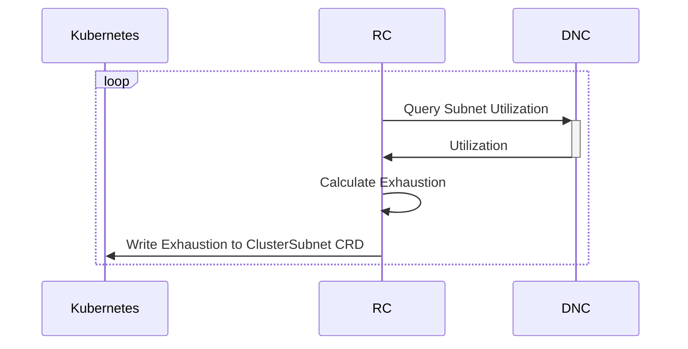

# DNC-RC watches and reacts to exhaustion [[Phase 1 Design]](../proposal.md#1-2-subnet-exhaustion-is-calculated-by-dnc-rc)

DNC-RC will poll the `SubnetState` API to periodically check the Subnet utilization. DNC-RC will be configured with a lower and upper threshold ( $T_l$ and $T_u$ ) as percentages of the Subnet capacity $C$. If the Subnet utilization $U$ crosses the upper threshold, DNC-RC will consider the Subnet "exhausted". If the Subnet utilization then falls below the lower threshold, DNC-RC will consider the Subnet "not exhausted". Two values are necessary to induce hysteresis and minimize oscillation between the two states.

$$
E = \neg E \text{ when}\begin{cases}
U \gt T_u \times C &\text{if } E \text{ is true}\\
U \lt T_l \times C &\text{if } E \text{ is false}
\end{cases}
$$

> Note: $\neg$ is the negation operator.

If the Subnet is exhausted, DNC-RC will write an additional, per-subnet CRD, the [`ClusterSubnetState`](https://github.com/Azure/azure-container-networking/blob/master/crd/clustersubnetstate/api/v1alpha1/clustersubnetstate.go), with a Status of `exhausted=true`. When the Subnet is un-exhausted, DNC-RC will write the Status as `exhausted=false`.

```yaml
apiVersion: acn.azure.com/v1alpha1
kind: ClusterSubnet
metadata:
    name: subnet
    namespace: kube-system
status:
    exhausted: true
    timestamp: 123456789
```


