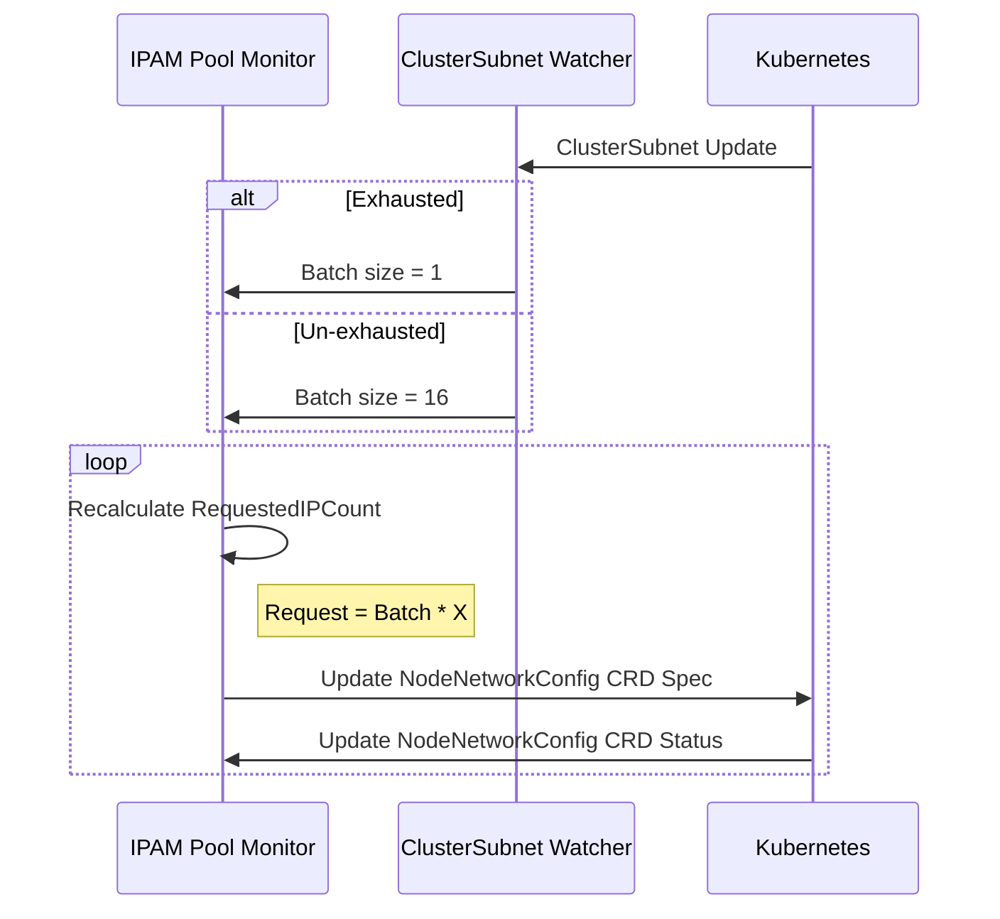

# CNS releases IPs back to Exhausted Subnets [[Phase 1 Design]](../proposal.md#1-3-ips-are-released-by-cns)

CNS will watch the `ClusterSubnetState` CRD and will update its internal state with the Subnet's exhaustion status. When the Subnet is exhausted, CNS will ignore the configured Batch size from the `NodeNetworkConfig`, and internally will use a Batch size of $1$. As the IPAM Pool Monitor reconciles the Pool, the changes to the Batch size will get picked up and applied to the subsequent Pool Scaling and target `RequestedIPCount`.

