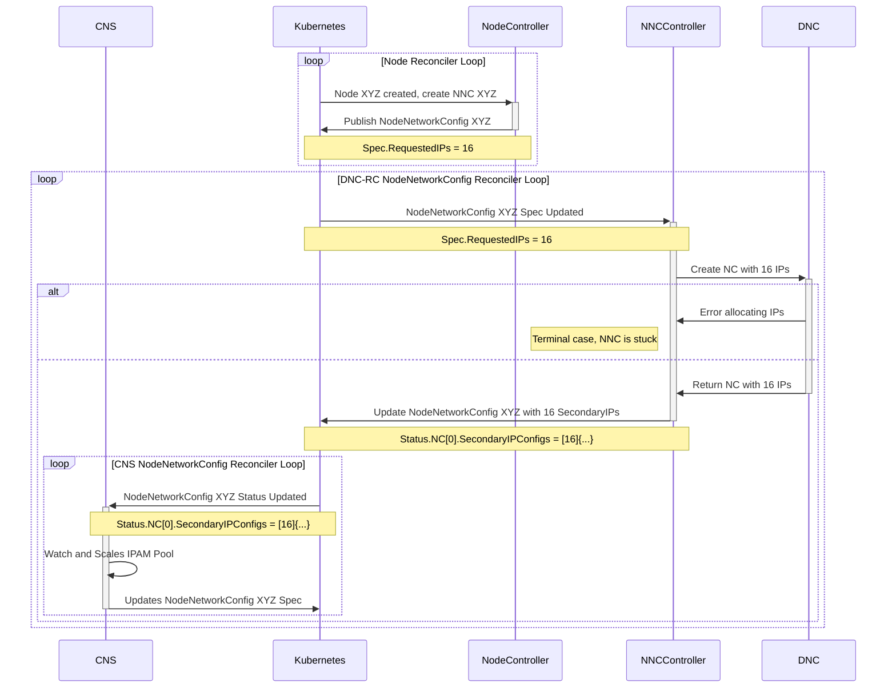
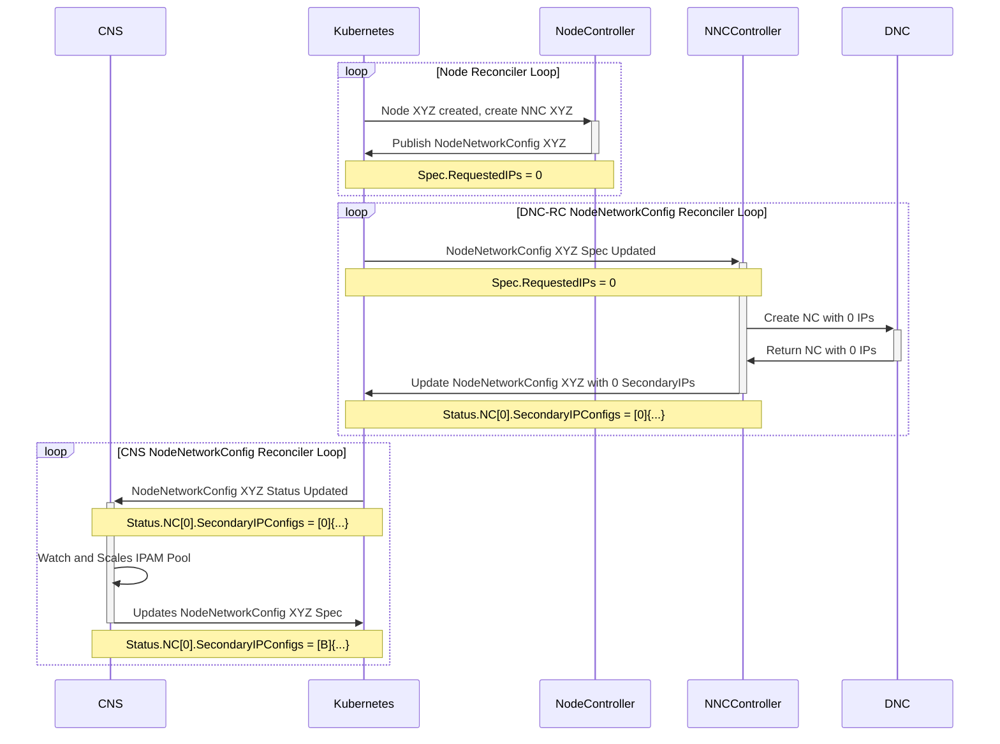

## DNC-RC creates empty NCs for new Nodes [[Phase 2 Design]](../proposal.md#2-1-dnc-rc-creates-ncs-with-no-secondary-ips)

When a new Node is created in the Cluster, the NodeController in DNC-RC will create a new stub NodeNetworkConfig associated with that Node. When a NodeNetworkConfig is Created/Updated/Deleted, the NodeNetworkConfigController will reconcile that NodeNetworkConfig target state.

Currently, the NodeController sets the [`Spec.RequestedIPCount`](https://github.com/Azure/azure-container-networking/blob/238d12fb6c3bf4132cecce9a1356b77d13816d1c/crd/nodenetworkconfig/api/v1alpha/nodenetworkconfig.go#L44) equal to the [`Status.Scaler.BatchSize`](https://github.com/Azure/azure-container-networking/blob/238d12fb6c3bf4132cecce9a1356b77d13816d1c/crd/nodenetworkconfig/api/v1alpha/nodenetworkconfig.go#L68) when it initially scaffolds the NodeNetworkConfig. When the NodeNetworkConfigController reconciles that NNC, it sees that the Spec contains a Requested IP Count and attempts to honor that request by making an IP allocation request to DNC. During this, [CNS is blocked, waiting for the NetworkContainer](https://github.com/Azure/azure-container-networking/blob/238d12fb6c3bf4132cecce9a1356b77d13816d1c/cns/kubecontroller/nodenetworkconfig/reconciler.go#L78) containing those SecondaryIPs to be added to the NNC. When DNC allocates the SecondaryIPs, the NodeNetworkConfigController writes the NetworkContainer to the NNC, and CNS starts its Pool Monitor loop.

Due to the division of responsibilities, it is possible for this flow to deadlock if the Subnet is exhausted. 
- the Node Reconciler loop is responsible for initially scaffolding the NNC for a new Node and can only set the Requested IP count safely when it is *creating* the NodeNetworkConfig
- the NodeNetworkConfig Reconciler loop is reacting to updates to the Requested IP count and attempting to honor them
- only CNS can update the Requested IP Count after an NNC has been created, as CNS does Pod IPAM on the Node

If the Subnet becomes exhausted _after_ the Node Reconciler loop has set the initial Requested IP count and the NodeNetworkConfig Reconciler is unable to honor the request, the NetworkContainer will never be written to the NNC Status. This Status update is what indicates to CNS that the Network is ready (enough for it to start). In this scenario, no running components can safely update the Request IP Count to get it within the constraints of the Subnet, and the NNC Status will never be updated. CNS will get no IPs, and no Pods can run on that Node.

#### Solution: Create NetworkContainer with no SecondaryIPs when creating NodeNetworkConfig

Instead of creating the NodeNetworkConfig with a Requested IP count of $B$, the NodeController will create NodeNetworkConfigs with a Requested IP count of $0$. The NodeNetworkController will create an NC Request with only single Primary IP and zero Secondary IPs for the initial create, and will write the empty NC to the NodeNetworkConfig Status. This skeleton NC in the NNC Status will be enough to signal to CNS to start the IPAM loop, and CNS will be able to iteratively adjust the Requested IP Count based on the current Subnet Exhaustion State at any time, as it does at steady state already.

Due to the shift of responsibility for asking for the initial Secondary IP allocation from the NodeController to CNS, there will be additional startup latency of one Request-Allocate loop duration while CNS asks for and waits to receive some Secondary IPs the first time.

However, this improved architecture breaks the hard startup dependency between CNS and the initial $B$ Secondary IP allocation. In this way, the initial *creation* of the NodeNetworkConfig has no special knowledge or cases, can be handled identically to the steady-state Update scenario, and can handle Subnet Exhaustion without the previous race/deadlock condition.
