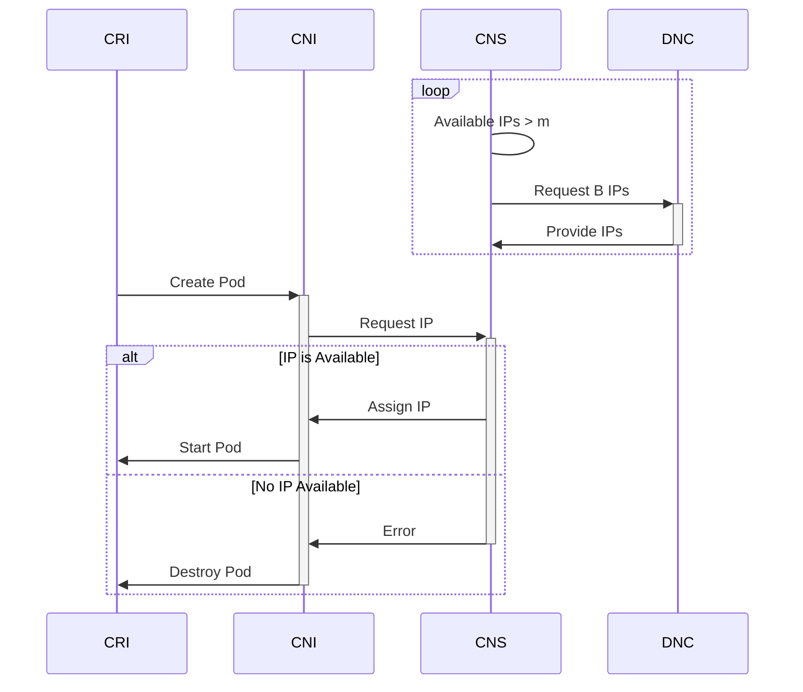

## CNS idempotent Pool Scaling math [[Phase 2 Design]](../proposal.md#2-2-cns-scales-ipam-pool-idempotently)

The current Pod IP allocation works as follows:
- CNS is allocated a Batch of IPs from DNC and records them internally as "Available"
- Pods are scheduled on the Node
    - The CRI creates a Pod Sandbox and asks the CNI to assign an IP
    - The CNI makes an IP assignment request to CNS
    - If there is an Available IP:
        - CNS allocates an Available IP out of the Pool.
    - If there is not an Available IP:
        - CNS returns an error
        - CNI returns an error
        - CRI tears down the Pod Sandbox
- As described in the [Background](../proposal.md#background), CNS watches the IPAM Pool and continuously verifies that there are at least the Minimum Free IPs left in the Pool. If there are not, it requests an additional Batch from RC via the `NodeNetworkConfig` CRD.
$$m = mf \times B \quad \text{the Minimum Free IPs}$$
$$\text{if } Available IPs \lt m \quad \text{request an additional Batch }B$$

The existing IP Pool scaling behavior in CNS is reactive and serial: CNS will only request to increase or decrease its Pool size by a single batch at a time. It reacts to the IP usage, attempting to adjust the Pool size to stay between the minimum and maximum free IPs, but it will only step the pool size by a single Batch at a time.

This introduces latency; CNS must calculate a new Pool size, request an additional Batch, wait for IPs to be allocated from DNC-RC, then loop. The request<->response loop for IP allocations may take several seconds.

### Idempotent Scaling Math

The process can be improved by directly calculating the target Pool size based on the current IP usage on the Node. Using this idempotent algorithm, we will always calculate the correct target Pool size in a single step based on the current IP usage.

The O(1) Pool scaling formula is:

$$
Request = B \times \lceil mf + \frac{U}{B} \rceil
$$

where $U$ is the number of Assigned (Used) IPs on the Node, $B$ is the Batch size, and $mf$ is the Minimum Free Fraction, as discussed in the [Background](../proposal.md#background).

The "Required" IP Count is forward looking without effecting the correctness of the Request: it represents the target quantity of IP addresses that CNS *will Assign to Pods* at some instant in time. This may include Pods scheduled which do not *currently* have Assigned IPs because there are insufficient Available IPs in the Pool.

In this way, at any point in time, CNS may calculate what its exact IP Request should be based on the instantaneous IP demand from currently scheduled Pods on its Node.

A concrete example:

$$
\displaylines{
    \text{Given: }\quad B=16\quad mf=0.5 \quad U=25 \text{ scheduled Pods}\\
    Request = 16 \times \lceil 0.5 + \frac{25}{16} \rceil\\
    Request = 16 \times \lceil 0.5 + 1.5625 \rceil\\
    Request = 16 \times \lceil 2.0625 \rceil\\
    Request = 16 \times 3 \\
    Request = 48
}
$$

As shown, if the demand is for $25$ IPs, and the Batch is $16$, and the Min Free is $8$ (half of the Batch), then the Request must be $48$. $32$ is too few, as $32-25=7 < 8$.

This algorithm will significantly improve the time-to-pod-ready for large changes in the quantity of scheduled Pods on a Node, due to eliminating all iterations required for CNS to converge on the final Requested IP Count.
